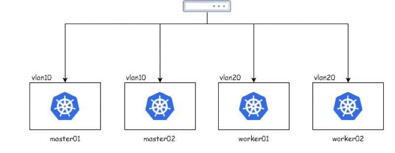
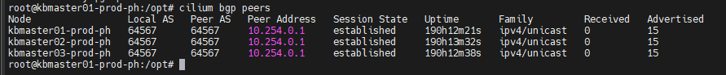

<div align="center">


<br><br>
</div>

# Network Deployment Scenarios with Cilium & BGP

## System Requirements
Ensure your system meets the following requirements before proceeding:

- **Operating System:** Ubuntu Server 24.04
- **Kernel Version:** 6.8+
- **Keppalived Installed**

## Topology Scenarios
This repository covers multiple network deployment scenarios using Cilium and BGP, categorized as follows:

### A. Common No VLAN
A standard setup without VLAN segmentation.


---

### B. Common VLAN (Bypass in Cilium Config)
A VLAN-based setup where Cilium is configured to bypass VLAN handling.



---

### C. BGP Peer Authentication with VLAN (Bypass in Cilium Config)
BGP setup with peer authentication and VLAN segmentation.


---

### D. BGP No Peer Authentication with VLAN (Bypass in Cilium Config)
BGP setup without peer authentication but with VLAN segmentation.


---

### E. BGP Peer Authentication No VLAN
BGP setup with peer authentication but without VLAN segmentation.


---

### F. BGP No Peer Authentication No VLAN
BGP setup without peer authentication and without VLAN segmentation.


---

## Setup Kubernetes Cluster
Please Setup Keepalived First, then follow steps below :

### 1. Enter All servers to "hosts" file
```
[masterinit]
192.168.20.143 host_name=master01.cilium.bt

[master]
192.168.20.144 host_name=master02.cilium.bt

[worker]
192.168.20.145 host_name=worker01.cilium.bt
192.168.20.146 host_name=worker02.cilium.bt
```

### 2. group_vars  

#### 2.1 Check Your Ethernet Speed  (Kernel Tuning)
If your Ethernet speed is **1Gi**, uncomment `"k8s_sysctl_ETH_1Gi"` in `group_vars`.  
If your Ethernet speed is **10Gi**, uncomment `"k8s_sysctl_ETH_10Gi"` instead.

#### 2.2 Basic System Configuration (Basic)
- Update **k8s_ipv** with your Keepalived virtual IP.  
- Set **timezone** to your local time zone.  
- Check for the latest Kubernetes version and update the repository accordingly.  
  You can find the latest version [here](https://kubernetes.io/releases).  
- Add your private registry under **registry**. 

### 3. Installation

First, enable the following variables in `playnow.yml` by setting them to `true`:  
```
# Kubernetes  
install_k8s_dependencies: true  
init_k8s_master: true  
join_k8s_masters: true  
join_k8s_workers: true  
reboot_after_update: true  # Optional, but recommended  
```
#### 3.1 Topology A (Common No VLAN)

Enable **install_cilium_common_no_vlan**. **Select only one option.**

```yaml
# Cilium (Select One)
install_cilium_common: false              # Install Cilium with a common setup (Bypasses VLAN)
install_cilium_common_no_vlan: true       # Install Cilium with a common setup (No VLAN) <--- ENABLE
install_cilium_bgp_auth: false            # Install Cilium with BGP and authentication (Bypasses VLAN)
install_cilium_bgp_no_auth: false         # Install Cilium with BGP but without authentication (Bypasses VLAN)
install_cilium_bgp_auth_no_vlan: false    # Install Cilium with BGP and authentication (No VLAN)
install_cilium_bgp_no_auth_no_vlan: false # Install Cilium with BGP but without authentication (No VLAN)
```

#### 3.2 Topology B (Common VLAN)

Enable **install_cilium_common**. **Select only one option.**

```yaml
# Cilium (Select One)
install_cilium_common: true               # Install Cilium with a common setup (Bypasses VLAN) <--- ENABLE
install_cilium_common_no_vlan: false      # Install Cilium with a common setup (No VLAN) 
install_cilium_bgp_auth: false            # Install Cilium with BGP and authentication (Bypasses VLAN)
install_cilium_bgp_no_auth: false         # Install Cilium with BGP but without authentication (Bypasses VLAN)
install_cilium_bgp_auth_no_vlan: false    # Install Cilium with BGP and authentication (No VLAN)
install_cilium_bgp_no_auth_no_vlan: false # Install Cilium with BGP but without authentication (No VLAN)
```

#### 3.3 Topology C (BGP Peer Authentication with VLAN)

Enable **install_cilium_bgp_auth**. **Select only one option.**

Configure BGP on the router and choose which nodes should be part of the BGP peer (recommended: all worker nodes, but only if the router has ECMP, if it doesn't you may use masters as BGP peer). Update the BGP variables in **group_vars**:

```yaml
# ===== CNI ===== #
# Cilium BGP
bgp:  # BGP Config
  - { localASN: 64555, peerASN: 64555, peerAddress: 192.168.20.1, bgpAuth: "my-super-secret" }

bgp_peers:  # BGP Peers
  - "worker01.cilium.bt"
  - "worker02.cilium.bt"
```

Modify the following values:
- **localASN** = The ASN assigned to the local node running Cilium.
- **peerASN** = The ASN of the remote BGP peer that Cilium peers with.
- **peerAddress** = The IP address of the remote BGP peer.
- **bgpAuth** = The authentication password for the BGP peer connection.

```yaml
# Cilium (Select One)
install_cilium_common: false              # Install Cilium with a common setup (Bypasses VLAN) 
install_cilium_common_no_vlan: false      # Install Cilium with a common setup (No VLAN) 
install_cilium_bgp_auth: true             # Install Cilium with BGP and authentication (Bypasses VLAN) <--- ENABLE
install_cilium_bgp_no_auth: false         # Install Cilium with BGP but without authentication (Bypasses VLAN)
install_cilium_bgp_auth_no_vlan: false    # Install Cilium with BGP and authentication (No VLAN)
install_cilium_bgp_no_auth_no_vlan: false # Install Cilium with BGP but without authentication (No VLAN)
```

#### 3.4 Topology D (BGP No Peer Authentication with VLAN)

Enable **install_cilium_bgp_no_auth**. **Select only one option.**

Configure BGP on the router and choose which nodes should be part of the BGP peer (recommended: all worker nodes, but only if the router has ECMP, if it doesn't you may use masters as BGP peer). Update the BGP variables in **group_vars**:

```yaml
# ===== CNI ===== #
# Cilium BGP
bgp:  # BGP Config
  - { localASN: 64555, peerASN: 64555, peerAddress: 192.168.20.1, bgpAuth: "my-super-secret" }

bgp_peers:  # BGP Peers
  - "worker01.cilium.bt"
  - "worker02.cilium.bt"
```

Modify the following values:
- **localASN** = The ASN assigned to the local node running Cilium.
- **peerASN** = The ASN of the remote BGP peer that Cilium peers with.
- **peerAddress** = The IP address of the remote BGP peer.

```yaml
# Cilium (Select One)
install_cilium_common: false              # Install Cilium with a common setup (Bypasses VLAN) 
install_cilium_common_no_vlan: false      # Install Cilium with a common setup (No VLAN) 
install_cilium_bgp_auth: false            # Install Cilium with BGP and authentication (Bypasses VLAN) 
install_cilium_bgp_no_auth: true          # Install Cilium with BGP but without authentication (Bypasses VLAN) <--- ENABLE
install_cilium_bgp_auth_no_vlan: false    # Install Cilium with BGP and authentication (No VLAN)
install_cilium_bgp_no_auth_no_vlan: false # Install Cilium with BGP but without authentication (No VLAN)
```

#### 3.5 Topology E (BGP Peer Authentication No VLAN)

Enable **install_cilium_bgp_auth_no_vlan**. **Select only one option.**

Configure BGP on the router and choose which nodes should be part of the BGP peer (recommended: all worker nodes, but only if the router has ECMP, if it doesn't you may use masters as BGP peer). Update the BGP variables in **group_vars**:

```yaml
# ===== CNI ===== #
# Cilium BGP
bgp:  # BGP Config
  - { localASN: 64555, peerASN: 64555, peerAddress: 192.168.20.1, bgpAuth: "my-super-secret" }

bgp_peers:  # BGP Peers
  - "worker01.cilium.bt"
  - "worker02.cilium.bt"
```

Modify the following values:
- **localASN** = The ASN assigned to the local node running Cilium.
- **peerASN** = The ASN of the remote BGP peer that Cilium peers with.
- **peerAddress** = The IP address of the remote BGP peer.
- **bgpAuth** = The authentication password for the BGP peer connection.

```yaml
# Cilium (Select One)
install_cilium_common: false              # Install Cilium with a common setup (Bypasses VLAN) 
install_cilium_common_no_vlan: false      # Install Cilium with a common setup (No VLAN) 
install_cilium_bgp_auth: false            # Install Cilium with BGP and authentication (Bypasses VLAN) 
install_cilium_bgp_no_auth: false         # Install Cilium with BGP but without authentication (Bypasses VLAN) 
install_cilium_bgp_auth_no_vlan: true     # Install Cilium with BGP and authentication (No VLAN) <--- ENABLE
install_cilium_bgp_no_auth_no_vlan: false # Install Cilium with BGP but without authentication (No VLAN)
```

#### 3.6 Topology F (BGP No Peer Authentication No VLAN)

Enable **install_cilium_bgp_no_auth_no_vlan**. **Select only one option.**

Configure BGP on the router and choose which nodes should be part of the BGP peer (recommended: all worker nodes, but only if the router has ECMP, if it doesn't you may use masters as BGP peer). Update the BGP variables in **group_vars**:

```yaml
# ===== CNI ===== #
# Cilium BGP
bgp:  # BGP Config
  - { localASN: 64555, peerASN: 64555, peerAddress: 192.168.20.1, bgpAuth: "my-super-secret" }

bgp_peers:  # BGP Peers
  - "worker01.cilium.bt"
  - "worker02.cilium.bt"
```

Modify the following values:
- **localASN** = The ASN assigned to the local node running Cilium.
- **peerASN** = The ASN of the remote BGP peer that Cilium peers with.
- **peerAddress** = The IP address of the remote BGP peer.

```yaml
# Cilium (Select One)
install_cilium_common: false              # Install Cilium with a common setup (Bypasses VLAN) 
install_cilium_common_no_vlan: false      # Install Cilium with a common setup (No VLAN) 
install_cilium_bgp_auth: false            # Install Cilium with BGP and authentication (Bypasses VLAN) 
install_cilium_bgp_no_auth: false         # Install Cilium with BGP but without authentication (Bypasses VLAN) 
install_cilium_bgp_auth_no_vlan: false    # Install Cilium with BGP and authentication (No VLAN) 
install_cilium_bgp_no_auth_no_vlan: true  # Install Cilium with BGP but without authentication (No VLAN) <--- ENABLE
```

After you choose the topology, let's start the installation (this could take some time),

```
ansible-playbook playnow.yml
```

### 4. Post-installation
#### 4.1 Optional Deploy ip-pool (Kubernetes segment)
```
kubectl apply -f - <<EOF
apiVersion: "cilium.io/v2alpha1"
kind: CiliumLoadBalancerIPPool
metadata:
  name: "ip-pool"
spec:
  allowFirstLastIPs: "No"
  blocks:
    - cidr: "10.12.130.0/24"
EOF
```
#### 4.2 Check Cilium Status
Login to master01 [masterinit], then

```
cilium status
```


#### 4.3 Check cilium connectivity

```
cilium hubble port-forward&
cilium connectivity test
```


#### 4.5 Check Cilium Health
```
curl -sLO https://raw.githubusercontent.com/cilium/cilium/main/contrib/k8s/k8s-cilium-exec.sh
chmod +x ./k8s-cilium-exec.sh

./k8s-cilium-exec.sh cilium-health status
./k8s-cilium-exec.sh cilium-dbg status
```

#### 4.5 BGP Check Peer Status
```
cilium bgp peers
```


### 5. Optional
#### 5.1 Disable Hubble (recommended)
```
cilium hubble disable
```

#### 5.2 Add New Private Registry
Modify "registry" in group_vars,

```
registry:
  - "new-registry-com"
  - "new-registry"
```

```
#Optional
add_private_registry: true                       # Add New Private Registry <--- ENABLE
get_join_command_and_control_plane_token: false  # Retrieve Join command and Control Plane TOKEN
update_hosts: false                              # Update /etc/hosts
uninstall_k8s: false                             # use with careful (Make Sure There Is No Job Set To "true")
```

Note : Make sure other vars value is "false"

#### 5.2 Retrieve Join command and Control Plane TOKEN
Just add master node to "[masterinit]" in hosts file

```
[masterinit]
192.168.20.143 host_name=cilium.master.bt
```

```
#Optional
add_private_registry: false                      # Add New Private Registry
get_join_command_and_control_plane_token: true   # Retrieve Join command and Control Plane TOKEN <--- ENABLE
update_hosts: false                              # Update /etc/hosts
uninstall_k8s: false                             # use with careful (Make Sure There Is No Job Set To "true")
```

Check "join" Folder

Note : Make sure other vars value is "false"

#### 5.3 Update /etc/hosts
Add all kubernetes nodes, and the new nodes to "hosts" file

```
[masterinit]
192.168.20.143 host_name=cilium1.master.bt

[master]
192.168.20.145 host_name=cilium2.master.bt
192.168.20.146 host_name=cilium3.master.bt

[worker]
192.168.20.147 host_name=cilium1.worker.bt
192.168.20.148 host_name=cilium2.worker.bt
192.168.20.149 host_name=cilium3.worker.bt <-- new
192.168.20.150 host_name=cilium4.worker.bt <-- new
```

```
#Optional
add_private_registry: false                      # Add New Private Registry
get_join_command_and_control_plane_token: false  # Retrieve Join command and Control Plane TOKEN
update_hosts: true                               # Update /etc/hosts <--- ENABLE
uninstall_k8s: false                             # use with careful (Make Sure There Is No Job Set To "true")
```

Note : Make sure other vars value is "false"

#### 5.4 DANGER!!! Uninstall kubernetes
Make sure you enter the correct node to "hosts" file

```
192.168.20.148 host_name=cilium2.worker.bt
```

```
#Optional
add_private_registry: false                      # Add New Private Registry
get_join_command_and_control_plane_token: false  # Retrieve Join command and Control Plane TOKEN
update_hosts: false                              # Update /etc/hosts 
uninstall_k8s: true                              # use with careful (Make Sure There Is No Job Set To "true") <--- ENABLE
```

Note : Make sure other vars value is "false"

## Contribution
Contributions are welcome!.

<div align="center">
<p>Have a good day!</p>
<div>

</div>
</div>

<div align="center">
<p></p>

</div>

<div align="center">

</div>